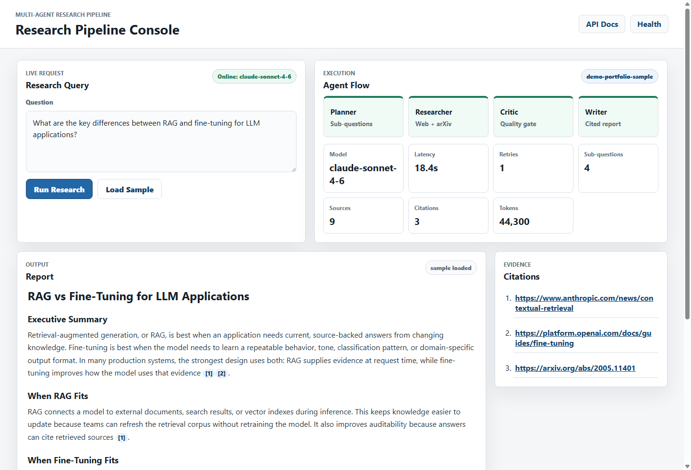

# Multi-Agent Research Pipeline

[](https://github.com/utkarshalpha/multi-agent-research-pipeline/actions/workflows/ci.yml)

An AI research assistant backend that turns one research question into a
structured, cited Markdown report. It uses FastAPI for the API, LangGraph for
agent orchestration, Anthropic Claude for reasoning, Tavily and arXiv for
research, Qdrant for semantic caching, and optional Redis for run memory. The
entire pipeline can also run **fully offline** with deterministic mocks — no
API keys required.

The portfolio demo console is served at:

```text
http://127.0.0.1:8000/
```

FastAPI's Swagger docs remain available at:

```text
http://127.0.0.1:8000/docs
```



## Run It With Zero API Keys (Mock Mode)

Set `MOCK_MODE=true` and the pipeline swaps the LLM, Tavily, arXiv, and the
embedder for deterministic offline mocks (`tools/mocks.py`). The full
Planner → Researcher → Critic → Writer graph runs end-to-end with zero network
calls and zero keys. **This is the supported way to build, test, and demo the
system until API keys are configured.**

PowerShell:

```powershell
python -m venv .venv
.\.venv\Scripts\Activate.ps1
pip install -r requirements.txt
$env:MOCK_MODE = "true"
$env:QDRANT_PATH = ":memory:"
uvicorn main:app
```

bash:

```bash
python -m venv .venv
source .venv/bin/activate
pip install -r requirements.txt
MOCK_MODE=true QDRANT_PATH=':memory:' uvicorn main:app
```

Then open `http://127.0.0.1:8000/` and run any query. Mock runs are clearly
labelled: `/health` and response metadata report the model as
`mock (claude-sonnet-4-6)`, so they can never be mistaken for live results.
Token counts are 0 in mock mode (the mock model bypasses the usage callback).

Tip: include the text `force-retry` in a query to make the mock Critic reject
the evidence and exercise the self-healing retry loop end to end.

## What It Does

The app runs a four-agent workflow:

| Agent | Responsibility |
| --- | --- |
| Planner | Breaks the user query into 3 to 5 focused sub-questions. |
| Researcher | Searches cache, Tavily, and arXiv for evidence. |
| Critic | Scores relevance, credibility, and recency. |
| Writer | Produces a cited Markdown report. |

If the Critic finds weak or missing evidence, the graph loops back to the
Researcher, which **reformulates the search queries from the Critic's
feedback** before retrying. Sub-questions with zero results are tracked (not
silently dropped), and total search failure also triggers retries — bounded by
`MAX_RETRIES`, after which the Writer proceeds with whatever evidence exists.

## Architecture

Read the detailed architecture guide: [`docs/ARCHITECTURE.md`](docs/ARCHITECTURE.md)

High-level flow:

```text
Query -> Planner -> Researcher -> Critic -> Writer -> Cited report
                   ^             |
                   |             v
        retry with reformulated queries
```

## Project Layout

```text
research_pipeline/
  main.py                    FastAPI app, auth/rate limiting, demo static hosting
  config.py                  Environment settings, LLM factory, retry helper
  agents/                    Planner, Researcher, Critic, Writer nodes
  graph/                     LangGraph state, graph builder, retry edge
  tools/                     Tavily, arXiv, Qdrant cache, offline mocks
  memory/                    Optional Redis run memory
  schemas/                   Pydantic contracts (agents + HTTP API)
  static/                    Portfolio demo console
  examples/sample_response.json
  docs/ARCHITECTURE.md
  evals/                     Eval set and quality-scoring runner
  tests/                     Offline unit + end-to-end suite (MOCK_MODE)
  Dockerfile                 App container image
  docker-compose.yml         Full stack: app + Redis + Qdrant
  .github/workflows/ci.yml   CI: offline test suite on every push/PR
```

## Quick Start (Live Keys)

PowerShell:

```powershell
python -m venv .venv
.\.venv\Scripts\Activate.ps1
pip install -r requirements.txt
Copy-Item .env.example .env
```

bash:

```bash
python -m venv .venv
source .venv/bin/activate
pip install -r requirements.txt
cp .env.example .env
```

Set at least these keys in `.env` for live research:

```text
ANTHROPIC_API_KEY=your_key_here
TAVILY_API_KEY=your_key_here
```

Start the app and open `http://127.0.0.1:8000/`:

```powershell
uvicorn main:app --reload
```

## Local Infrastructure

The project runs without Docker if `.env` uses embedded Qdrant (the
`.env.example` default):

```text
QDRANT_PATH=./qdrant_local
```

`QDRANT_PATH=:memory:` runs Qdrant fully in-memory (used by the tests and CI).
Redis is optional: if it is not running, the app logs that short-term memory is
disabled and continues.

## Docker

`docker-compose.yml` now includes the **app service** alongside Redis and
Qdrant, so one command brings up the whole stack on `http://localhost:8000`.

Keyless mock stack (fully offline):

```powershell
$env:MOCK_MODE = "true"
docker compose up --build
```

```bash
MOCK_MODE=true docker compose up --build
```

Live stack — export the keys in your shell (or put them in a local `.env`,
which Compose reads for variable substitution):

```bash
export ANTHROPIC_API_KEY=... TAVILY_API_KEY=...
docker compose up --build
```

The compose file points the app at the in-cluster services
(`QDRANT_URL=http://qdrant:6333`, `REDIS_URL=redis://redis:6379`) and passes
through `MOCK_MODE`, `ANTHROPIC_API_KEY`, `TAVILY_API_KEY`, `LANGSMITH_API_KEY`,
and `PIPELINE_API_KEY` with empty-safe defaults, so the stack boots keyless in
mock mode. The image runs as an unprivileged user and ships a `/health`-based
healthcheck.

### Prebuilt image (GHCR)

CI builds the image on every push to `main`, smoke-tests it keyless (boots the
container in mock mode and runs a real `POST /research` against it), and
publishes it to GitHub Container Registry. To run it anywhere with Docker — no
clone, no keys:

```bash
docker run -p 8000:8000 -e MOCK_MODE=true -e QDRANT_PATH=':memory:' \
  ghcr.io/utkarshalpha/multi-agent-research-pipeline:latest
```

Then open `http://localhost:8000/`. Pass real `ANTHROPIC_API_KEY` /
`TAVILY_API_KEY` env vars instead of `MOCK_MODE` for live research.

## API Usage

PowerShell:

```powershell
Invoke-RestMethod -Method Post -Uri "http://127.0.0.1:8000/research" `
  -ContentType "application/json" `
  -Body '{"query":"What are the key differences between RAG and fine-tuning for LLM applications?"}'
```

bash:

```bash
curl -X POST "http://127.0.0.1:8000/research" \
  -H "Content-Type: application/json" \
  -d '{"query":"What are the key differences between RAG and fine-tuning for LLM applications?"}'
```

If `PIPELINE_API_KEY` is set on the server, add the header
(`-Headers @{ "X-API-Key" = "..." }` / `-H "X-API-Key: ..."`).

The response shape is:

```json
{
  "run_id": "uuid",
  "report": "# Markdown report",
  "citations": ["https://source.example"],
  "metadata": {
    "model": "claude-sonnet-4-6",
    "latency_seconds": 18.4,
    "retry_count": 1,
    "num_sub_questions": 4,
    "num_sources": 9,
    "num_citations": 3,
    "token_usage": {
      "input_tokens": 41200,
      "output_tokens": 3100,
      "total_tokens": 44300
    },
    "unanswered_questions": []
  }
}
```

The numbers above are illustrative. In mock mode `model` reads
`mock (claude-sonnet-4-6)` and token counts are 0. `unanswered_questions`
lists any sub-questions that never gathered evidence, even after retries.

Error responses: `401` (missing/invalid `X-API-Key` when auth is enabled),
`422` (query shorter than 3 chars), `429` (rate limit), `500` (sanitized
internal error with `run_id`), `504` (run exceeded `RESEARCH_TIMEOUT_SECONDS`).

## Configuration

Everything is set via environment variables (or `.env`); see `.env.example`
for the full annotated list. Notable settings:

| Variable | Default | Purpose |
| --- | --- | --- |
| `MOCK_MODE` | `false` | Run the entire pipeline offline with deterministic mocks; no keys needed. |
| `RESEARCH_TIMEOUT_SECONDS` | `300` | Hard wall-clock limit per `/research` run; HTTP 504 on expiry. |
| `PIPELINE_API_KEY` | (empty) | When set, `POST /research` requires a matching `X-API-Key` header. Empty disables auth. |
| `RATE_LIMIT_PER_MINUTE` | `0` | Per-client-IP request cap on `POST /research`; `0` disables. |
| `MAX_RETRIES` | `2` | Critic-loop retry budget. |
| `CONFIDENCE_PASS_THRESHOLD` | `0.7` | Minimum combined score a result must reach to pass the Critic. |
| `QDRANT_PATH` | (empty) | Embedded Qdrant dir, or `:memory:`; empty uses `QDRANT_URL`. |

## Sample Demo Response

`GET /sample-response` serves the saved run in `examples/sample_response.json`.
The browser console uses it so the portfolio UI can be shown without spending
tokens or depending on live API keys.

## Tests

The full suite is offline: every test module forces `MOCK_MODE=true` and
`QDRANT_PATH=:memory:`, so no keys, Docker, or network are needed. It covers
graph edges, Critic scoring, Writer rendering, mock determinism contracts, the
demo routes, and end-to-end `POST /research` runs (including auth, rate
limiting, and the retry loop).

PowerShell:

```powershell
$env:MOCK_MODE = "true"; $env:QDRANT_PATH = ":memory:"
python -m unittest discover -s tests -v
```

bash:

```bash
MOCK_MODE=true QDRANT_PATH=':memory:' python -m unittest discover -s tests -v
```

(The env prefix matches CI exactly; plain `python -m unittest discover -s tests`
also works because the modules set those variables themselves.)

### CI

`.github/workflows/ci.yml` runs this exact suite on every push and pull
request to `main` (Ubuntu, Python 3.12) — no secrets required. On pushes to
`main`, a second job then builds the Docker image, smoke-tests the running
container in mock mode (health check plus a real `POST /research`), and
publishes it to `ghcr.io/utkarshalpha/multi-agent-research-pipeline`.

## Evals

The harness in `evals/run_evals.py` runs the questions in `evals/eval_set.json`
through the graph and measures latency, retries, citations, and estimated token
cost, **plus structural quality per run**: report presence and length, section
count, citations present, **groundedness** (every cited URL must appear in the
sources actually gathered — catches hallucinated citations), and sub-question
coverage. These collapse into a `quality_score` in `[0, 1]` with a pass bar of
0.7.

```bash
# Offline smoke run, first 3 questions, no keys:
MOCK_MODE=true QDRANT_PATH=':memory:' python -m evals.run_evals --limit 3

# Full live suite (keys configured):
python -m evals.run_evals
```

Results are written to `evals/results.json` (gitignored) as
`{metadata, aggregate, runs}`. The metadata and every run record a `mock` flag
and a clearly-labelled model name, so mock results can never be passed off as
live ones. A summary table (latency / retries / groundedness / coverage /
quality / cost) is printed to stdout.

## Portfolio Status

An honest snapshot of where the project stands.

**Implemented and verified — in mock mode.** The full multi-agent pipeline
(planning, cached + parallel research, critic scoring, feedback-driven retries,
cited report writing), the hardened API surface (optional key auth, rate
limiting, timeouts, sanitized errors), the demo console, the eval harness with
quality/groundedness scoring, and the Docker/CI assets all exist and are
exercised by the offline test suite (61 tests, green) on every push. The
Docker image is built, smoke-tested (a real `POST /research` against the
running container), and published to GHCR by CI on every push to `main`.

**Not yet validated live.** No end-to-end run has been made against the real
Anthropic, Tavily, or arXiv APIs — that requires keys. Latency, cost, and
report-quality numbers shown in this README are illustrative, not measured.

**Remaining work:**

1. Live validation with real API keys, including a full eval run and real
   `results.json` numbers.
2. A short recorded walkthrough of the console, `/docs`, and one live run.
3. A hosted deployment.

## Deployment Notes

For a portfolio deployment:

1. Use the provided `Dockerfile` / `docker-compose.yml`, or run Uvicorn (plus
   Gunicorn workers) directly.
2. Use managed Redis if you want persistent run memory.
3. Use embedded Qdrant only for local demos; use a managed or containerized
   Qdrant instance for production.
4. Store API keys as secrets, not in the repository; set `PIPELINE_API_KEY`
   and `RATE_LIMIT_PER_MINUTE` on anything public.
