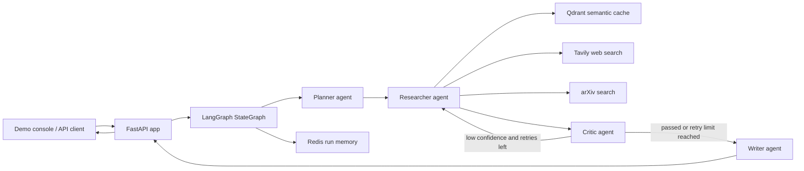

# Architecture

This project is a FastAPI service that turns one research question into a cited
Markdown report. The backend is organized around a LangGraph state machine with
four specialist agents and two optional memory layers.

## System View



## Request Flow

1. A user submits `POST /research` with a query.
2. FastAPI creates a `run_id` and initializes the graph state.
3. The Planner decomposes the query into 3 to 5 focused sub-questions.
4. The Researcher checks Qdrant for cached evidence, then gathers fresh web and
   arXiv results for cache misses.
5. The Critic scores relevance, credibility, and recency. If any result is below
   the pass threshold and retry budget remains, weak questions are researched
   again.
6. The Writer creates a structured Markdown report with inline citation markers.
7. FastAPI returns the report, citations, and metadata.

## Core Components

| Component | File | Purpose |
| --- | --- | --- |
| API layer | `main.py` | FastAPI routes, lifecycle, response shape, demo static hosting |
| Graph builder | `graph/graph.py` | LangGraph nodes and edges |
| Retry edge | `graph/edges.py` | Critic loop decision |
| Shared state | `graph/state.py` | Typed graph state contract |
| Agents | `agents/*.py` | Planner, Researcher, Critic, Writer behavior |
| Schemas | `schemas/models.py` | Pydantic contracts for agent I/O |
| Search tools | `tools/search.py`, `tools/arxiv.py` | External evidence gathering |
| Vector cache | `tools/vector_store.py` | Embedded or remote Qdrant semantic cache |
| Run memory | `memory/redis_store.py` | Optional Redis-backed run artifacts |
| Demo UI | `static/*` | Portfolio console at `/` |
| Sample run | `examples/sample_response.json` | Token-free demo payload |

## Data Contracts

`ResearchResponse` is the main portfolio-facing contract:

```json
{
  "run_id": "string",
  "report": "Markdown string",
  "citations": ["https://source.example"],
  "metadata": {
    "model": "claude-sonnet-4-6",
    "latency_seconds": 18.4,
    "retry_count": 1,
    "num_sub_questions": 4,
    "num_sources": 9,
    "num_citations": 3,
    "token_usage": {
      "input_tokens": 41200,
      "output_tokens": 3100,
      "total_tokens": 44300
    }
  }
}
```

## Runtime Dependencies

- Required for live research: `ANTHROPIC_API_KEY` and `TAVILY_API_KEY`.
- Optional observability: `LANGSMITH_API_KEY`.
- Optional Redis: if unavailable, short-term memory is disabled but the API
  still runs.
- Optional Docker Qdrant: the included `.env` can use `QDRANT_PATH=./qdrant_local`
  for embedded local Qdrant without Docker.

## Portfolio Readiness

The project is portfolio-worthy as an AI/backend project because it demonstrates:

- Multi-agent orchestration with LangGraph.
- Structured Pydantic contracts.
- External tool use with Tavily and arXiv.
- Semantic caching through Qdrant.
- Self-healing retry logic through the Critic loop.
- API and demo UI surfaces.
- Evaluation harness for repeatable testing.

The next high-value improvements are deployment, real eval result screenshots,
and a short recorded demo using the console at `/`.
