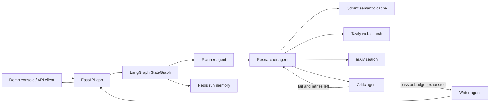

# Architecture

This project is a FastAPI service that turns one research question into a cited
Markdown report. The backend is organized around a LangGraph state machine with
four specialist agents, two optional memory layers, and a deterministic offline
mock layer (`MOCK_MODE`) that lets the entire pipeline run with no API keys and
no network access.

## System View



In `MOCK_MODE` the LLM, Tavily, arXiv, and the embedder are swapped for the
deterministic mocks in `tools/mocks.py`; the graph, agents, and API run
unchanged.

## Request Flow

1. A client submits `POST /research`. If `PIPELINE_API_KEY` is set, the request
   must carry a matching `X-API-Key` header (constant-time compare; 401
   otherwise). If `RATE_LIMIT_PER_MINUTE` > 0, a per-client-IP sliding-window
   limit applies (429 on excess).
2. FastAPI creates a `run_id` and runs the graph under a hard wall-clock limit
   (`RESEARCH_TIMEOUT_SECONDS`, default 300s; HTTP 504 on expiry). Unexpected
   failures return a sanitized 500 carrying only the `run_id` — the traceback
   stays in the server logs.
3. The Planner decomposes the query into 3 to 5 focused sub-questions.
4. The Researcher checks the Qdrant semantic cache, then gathers fresh Tavily
   and arXiv results in parallel for cache misses.
5. The Critic scores every result and fails the critique if any result is below
   the pass threshold, any sub-question has zero evidence, or nothing was
   retrieved at all.
6. On a failed critique with retry budget left, the graph loops back to the
   Researcher (see "The Critic Loop" below).
7. The Writer produces a structured Markdown report with inline `[n]` citation
   markers — or a graceful stub report if no evidence survived.
8. FastAPI returns the report, citations, and metadata, including any
   `unanswered_questions` that never gathered evidence.

## The Critic Loop

Each `ResearchResult` gets a combined confidence score from three dimensions:

| Dimension | Weight | How it is judged |
| --- | --- | --- |
| Relevance | 0.5 | LLM structured output (the subjective part). |
| Credibility | 0.25 | Deterministic: arXiv = 1.0, known outlets / `.gov` / `.edu` = 0.8, unknown = 0.5. |
| Recency | 0.25 | Deterministic from the publication date: ≤1 yr = 1.0, ≤3 yr = 0.7, older = 0.4, unknown = 0.6. |

`overall_pass` is true only when **at least one result exists, every result
scores ≥ `CONFIDENCE_PASS_THRESHOLD`, and every sub-question has evidence**. An
empty result set always fails, so total search failure also enters the retry
loop instead of vacuously passing.

On a failed critique (`graph/edges.py: should_retry` is the single budget gate
— retry iff the critique failed and `retry_count < MAX_RETRIES`):

- Previously approved results are **kept**; only the low-confidence
  sub-questions plus any zero-result (`unanswered`) sub-questions are
  re-researched.
- Each retried query is **reformulated from the Critic's feedback**:
  content-bearing keywords are distilled from the feedback (deterministic — no
  extra LLM call, identical in mock mode) and appended to the sub-question,
  rotated by attempt number, so the search tools receive a different query on
  every attempt.
- The semantic cache is bypassed on retries so genuinely fresh evidence is
  fetched.
- Sub-questions that still have no evidence are tracked in
  `state["unanswered_questions"]` (persisted to Redis and surfaced in response
  metadata) rather than being silently dropped.

Once the budget is exhausted, the Writer runs with whatever evidence exists.

## Mock Mode

`MOCK_MODE=true` (parsed in `config.py`) makes the whole pipeline offline and
deterministic — everything is hash-derived from its inputs, with zero
randomness and zero network calls:

- `MockChatModel` duck-types `ChatAnthropic` for the agents' usage:
  `with_structured_output(Schema).ainvoke(...)` returns a valid instance of any
  Pydantic schema via introspection, with quality special-cases for the
  Planner's sub-questions, the Critic's relevance assessment, and the Writer's
  report (sections carry real `[n]` markers and citations).
- Mock Tavily/arXiv return canned, correctly-shaped results whose content
  echoes the query verbatim; the mock embedder returns a deterministic 384-dim
  unit vector (no model download).
- `/health` and response metadata label the model as e.g.
  `mock (claude-sonnet-4-6)`, so mock output is never mistaken for live output.
- Test hook: a query containing `force-retry` makes the mock Critic score
  relevance very low, exercising the full retry loop end to end.

Known limitations: the mock model is not a LangChain `BaseChatModel`, so token
usage reads 0 in mock mode and mock LLM calls are not traced by LangSmith.

## Core Components

| Component | File | Purpose |
| --- | --- | --- |
| API layer | `main.py` | FastAPI routes, lifecycle, auth, rate limiting, timeout, demo static hosting |
| Settings | `config.py` | Env-driven settings, LLM factory (mock-aware), tenacity retry helper |
| Graph builder | `graph/graph.py` | LangGraph nodes and edges |
| Retry edge | `graph/edges.py` | Critic-loop budget gate (`should_retry`) |
| Shared state | `graph/state.py` | Typed graph state contract (incl. `unanswered_questions`) |
| Agents | `agents/*.py` | Planner, Researcher, Critic, Writer behavior |
| Schemas | `schemas/models.py` | Pydantic contracts for agent I/O **and** the HTTP API (`ResearchRequest`/`ResearchResponse`) |
| Search tools | `tools/search.py`, `tools/arxiv.py` | External evidence gathering (with retry; mock-aware) |
| Offline mocks | `tools/mocks.py` | Deterministic LLM/search/embedding stand-ins for `MOCK_MODE` |
| Vector cache | `tools/vector_store.py` | Embedded, in-memory, or remote Qdrant semantic cache |
| Run memory | `memory/redis_store.py` | Optional Redis-backed run artifacts |
| Demo UI | `static/*` | Portfolio console at `/` |
| Sample run | `examples/sample_response.json` | Token-free demo payload |
| Eval harness | `evals/run_evals.py` | Latency/cost plus quality + groundedness scoring, `--limit` flag |
| Tests | `tests/*` | Offline unit + end-to-end suite (runs in `MOCK_MODE`) |
| Container | `Dockerfile`, `docker-compose.yml` | App image + full app/Redis/Qdrant stack |
| CI | `.github/workflows/ci.yml` | Runs the offline suite on every push/PR to `main` |

## Data Contracts

The HTTP contracts live in `schemas/models.py` alongside the agent contracts
and are imported by `main.py`. `ResearchRequest` is `{"query": str}` (min
length 3). `ResearchResponse` is the main portfolio-facing contract:

```json
{
  "run_id": "string",
  "report": "Markdown string",
  "citations": ["https://source.example"],
  "metadata": {
    "model": "claude-sonnet-4-6",
    "latency_seconds": 18.4,
    "retry_count": 1,
    "num_sub_questions": 4,
    "num_sources": 9,
    "num_citations": 3,
    "token_usage": {
      "input_tokens": 41200,
      "output_tokens": 3100,
      "total_tokens": 44300
    },
    "unanswered_questions": []
  }
}
```

In mock mode `model` reads `mock (...)` and token counts are 0.

## Configuration

All settings are environment variables read once at import by `config.py`
(`.env` supported; see `.env.example` for the full annotated list). Beyond the
model/infrastructure basics, the notable knobs are:

| Variable | Default | Purpose |
| --- | --- | --- |
| `MOCK_MODE` | `false` | Fully offline pipeline with deterministic mocks (`1`/`true`/`yes`). |
| `RESEARCH_TIMEOUT_SECONDS` | `300` | Hard per-run wall-clock limit; HTTP 504 on expiry. |
| `PIPELINE_API_KEY` | (empty) | Static API key for `POST /research`; empty disables auth. |
| `RATE_LIMIT_PER_MINUTE` | `0` | Per-client-IP sliding-window cap; `0` disables. |
| `MAX_RETRIES` | `2` | Critic-loop retry budget. |
| `CONFIDENCE_PASS_THRESHOLD` | `0.7` | Per-result pass bar in the Critic. |

Resilience details: the LLM retry decorator (`config.llm_retry`) backs off only
on transient Anthropic errors (connection, timeout, 429, 5xx) and fails fast on
client errors; Tavily calls retry up to 3 times; Redis and Qdrant failures
degrade gracefully (memory disabled / cache misses) instead of failing the run.

## Runtime Dependencies

- Required for live research: `ANTHROPIC_API_KEY` and `TAVILY_API_KEY`.
  **`MOCK_MODE=true` requires none of them.**
- Optional observability: `LANGSMITH_API_KEY`.
- Optional Redis: if unavailable, short-term memory is disabled but the API
  still runs.
- Qdrant: copy `.env.example` to `.env` — its default
  `QDRANT_PATH=./qdrant_local` runs Qdrant embedded with no Docker;
  `QDRANT_PATH=:memory:` runs it in-memory (tests/CI); leave `QDRANT_PATH`
  empty to use a remote `QDRANT_URL` (the docker-compose setup).

## Testing and CI

The test suite under `tests/` is fully offline (every module forces
`MOCK_MODE=true` and `QDRANT_PATH=:memory:`) and covers the retry edge, Critic
scoring, Writer rendering, mock determinism contracts, demo routes, and
end-to-end `POST /research` runs including auth, rate limiting, and the
force-retry loop. `.github/workflows/ci.yml` runs the same suite on every push
and pull request to `main` with no secrets.

## Status

Honestly stated: every component above is implemented and verified **in mock
mode** by the offline suite. The pipeline has not yet been validated against
the live Anthropic/Tavily/arXiv APIs (keys required), and the Docker image has
not yet been built on a Docker host. The next high-value steps are a live
validation run (with real eval results), a short recorded demo of the console
at `/`, and a hosted deployment.
